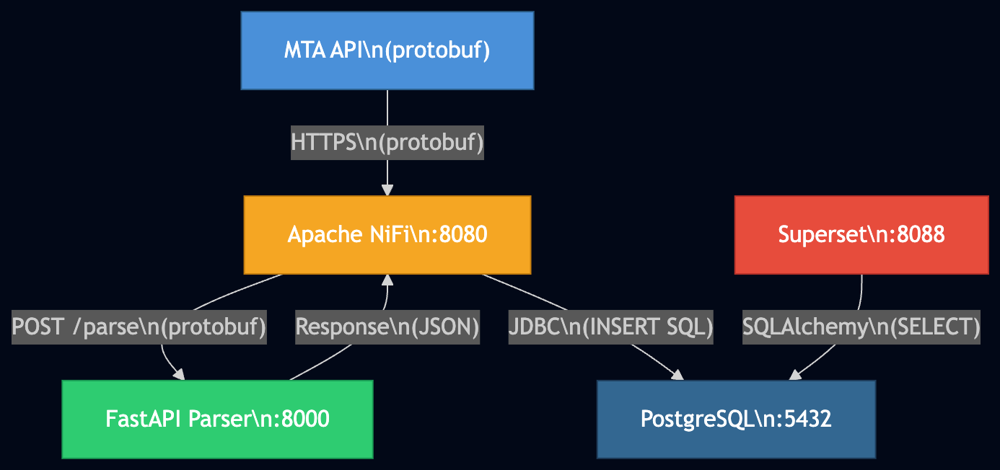
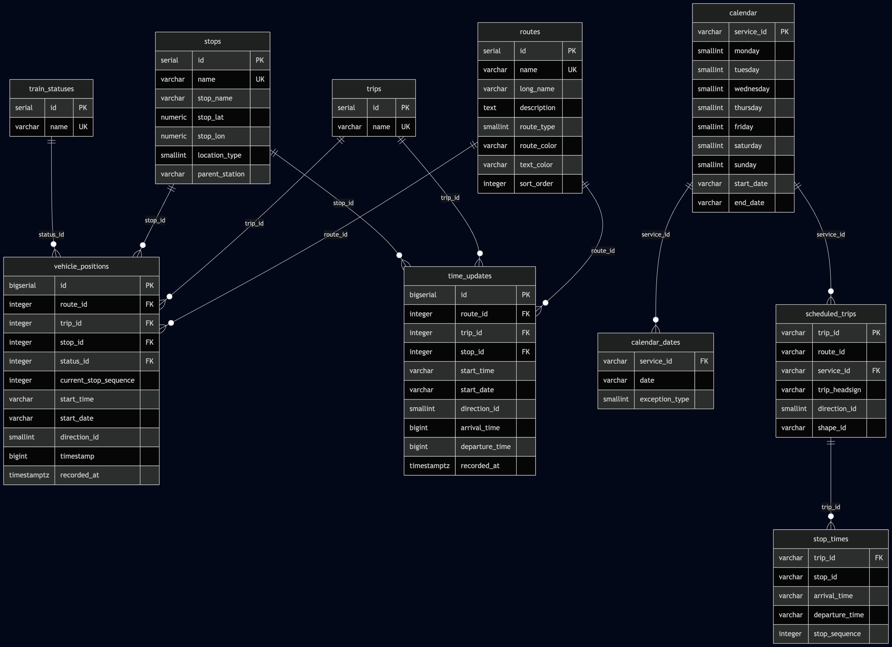

# MTA Subway Realtime - Real Time Pipeline

Alejandra Alvarado | Rudy Osorio | Erick Marroquin

## Proyecto final - Big Data 2

Pipeline de datos en tiempo real que ingesta, parsea, almacena y visualiza la informacion del subway de Nueva York usando los feeds GTFS-Realtime de la MTA.

## Objetivo

Construir una plataforma de datos que:

1. **Ingeste** los feeds GTFS-RT (protobuf) de la MTA en tiempo real
2. **Parsee** el protobuf a JSON estructurado
3. **Almacene** posiciones de trenes y predicciones de llegada en PostgreSQL
4. **Enriquezca** los datos con schedules estaticos GTFS para deteccion de delays
5. **Visualice** los datos mediante dashboards interactivos en Superset

## Arquitectura



NiFi orquesta todo el flujo: cada 30 segundos hace fetch del feed GTFS-RT de la MTA, lo envia a FastAPI para parsearlo de protobuf a JSON, y luego lo envia de vuelta a FastAPI para persistirlo en PostgreSQL. Superset consulta las vistas gold directamente para los dashboards.

## Servicios

| Servicio       | Contenedor       | Puerto  | Descripcion                                                |
|----------------|------------------|---------|------------------------------------------------------------|
| **PostgreSQL** | `mta-postgres`   | `5432`  | Almacena datos de la MTA y metadatos de Superset           |
| **FastAPI**    | `mta-api`        | `8000`  | Parsea protobuf GTFS-RT a JSON y guarda a la base de datos |
| **NiFi**       | `mta-nifi`       | `8080`  | Orquesta la ingesta: fetch, parse y carga a la base        |
| **Superset**   | `mta-superset`   | `8190`  | Dashboards y visualizacion de datos                        |

Todos los servicios comparten la red Docker `mta` (bridge), lo que permite la comunicacion interna por nombre de contenedor.

## Flujo de Datos


## Modelo de Datos — Arquitectura Medallion

El modelo sigue una **arquitectura medallion** con tres capas: Bronze para datos crudos, Silver para datos de referencia, y Gold para vistas enriquecidas listas para consumo.



### Bronze — Datos Crudos y Dimensiones

Datos en tiempo real tal como llegan del feed de la MTA. Incluye tablas de dimension (`routes`, `stops`, `trips`, `train_statuses`) y tablas de hechos (`vehicle_positions`, `time_updates`) con deduplicacion automatica.

### Silver — Schedule GTFS Estatico

Horarios oficiales del subway cargados una sola vez desde los archivos GTFS estaticos. Incluye `calendar`, `calendar_dates`, `scheduled_trips` y `stop_times`.

### Gold — Vistas Enriquecidas

Vistas SQL que combinan datos realtime con los schedules estaticos:

- **`v_gold_vehicle_positions`** — Posiciones de trenes enriquecidas con nombre de ruta, color, estacion y coordenadas. Lista para visualizar en un mapa.
- **`v_gold_time_updates`** — Compara las predicciones de llegada en tiempo real contra el horario programado para detectar delays. Si un tren tiene mas de 5 minutos de retraso se marca como `DELAYED`, esta es una métrica del MTA que considera un tren retrasado si se pasa de 300 segundos (5 minutos) de la hora calendarizada.

## Estructura del Proyecto

```
mta-nifi/
├── api/
│   ├── main.py                  # App FastAPI (endpoints /health, /parse, /save)
│   └── requirements.txt         # Dependencias Python
├── database/
│   ├── mta.sql                  # DDL: tablas, indices, constraints, vistas gold
│   ├── seed.sql                 # Datos iniciales (rutas, estados, calendario)
│   ├── seed_gtfs.sql            # Datos GTFS estaticos (scheduled_trips, stop_times)
│   ├── gtfs/                    # Archivos fuente GTFS (routes, stops, trips, etc.)
│   └── mta_g_feed.json          # Ejemplo de feed GTFS-RT convertido a JSON
├── dockerfiles/
│   ├── api/
│   │   └── Dockerfile           # Imagen Python 3.11-slim + uvicorn
│   ├── nifi/
│   │   ├── Dockerfile           # NiFi 1.23.2 + driver JDBC PostgreSQL
│   │   └── set-proxy-host.sh    # Script de configuracion de proxy
│   ├── postgres/
│   │   ├── Dockerfile           # PostgreSQL 15-alpine
│   │   └── init/
│   │       └── 01_init.sql      # Crea la base de datos de Superset
│   └── superset/
│       ├── Dockerfile           # Superset 3.1.3 + psycopg2
│       ├── docker-entrypoint.sh # Bootstrap: migrations, admin, datasource
│       └── superset_config.py   # Configuracion de Superset
├── docs/
│   ├── arquitectura.mmd         # Diagrama de arquitectura (Mermaid)
│   ├── flujo-datos.mmd          # Diagrama de flujo de datos (Mermaid)
│   └── modelo-datos.mmd         # Diagrama ER del modelo de datos (Mermaid)
├── .env                         # Variables de entorno (no versionado)
├── .env.example                 # Plantilla de variables de entorno
├── docker-compose.yml           # Orquestacion de todos los servicios (no versionado)
├── docker-compose.yml.example   # Plantilla de docker-compose
└── README.md
```

## Inicio Rapido

### Prerequisitos

- Docker y Docker Compose

### 1. Copiar archivos de configuracion

Tanto `docker-compose.yml` como `.env` no se versionan ya que dependen de cada entorno. Copiar las plantillas y ajustar segun sea necesario:

```bash
cp docker-compose.yml.example docker-compose.yml
cp .env.example .env
# Editar ambos archivos con tus credenciales y configuracion
```

### 2. Levantar los servicios

```bash
docker compose up --build
```

### 3. Verificar que todo funciona

```bash
# Health del parser
curl http://localhost:8000/health

# NiFi UI
open http://localhost:8080/nifi/

# Superset UI
open http://localhost:8190
```

## API — FastAPI

| Metodo | Ruta      | Content-Type               | Descripcion                                     |
|--------|-----------|----------------------------|--------------------------------------------------|
| GET    | `/health` | —                          | Healthcheck, retorna `{"status": "ok"}`          |
| POST   | `/parse`  | `application/octet-stream` | Recibe protobuf GTFS-RT, retorna JSON            |
| POST   | `/save`   | `application/json`         | Recibe JSON parseado, guarda en PostgreSQL       |

### Ejemplo: parsear un feed

```bash
curl -X POST http://localhost:8000/parse \
  -H "Content-Type: application/octet-stream" \
  --data-binary @feed.pb
```

### Ejemplo: guardar a la base de datos

El endpoint `/save` recibe el JSON generado por `/parse` y lo persiste en las tablas `vehicle_positions` y `time_updates`. NiFi orquesta este flujo automaticamente.

## Consultas Visualización

Una vez que hay datos en la base, las vistas gold estan disponibles para consulta directa:

```sql
-- Posiciones de trenes enriquecidas
SELECT * FROM v_gold_vehicle_positions LIMIT 20;

-- Delays: prediccion vs. schedule
SELECT route, stop_name, direction, delay_seconds, trip_status
FROM v_gold_time_updates
WHERE trip_status = 'DELAYED'
ORDER BY delay_seconds DESC
LIMIT 20;
```

## Credenciales por Defecto

| Servicio    | Usuario | Contrasena          | Notas                    |
|-------------|---------|---------------------|--------------------------|
| PostgreSQL  | `admin` | `admin123`          | Puerto host: `5433`      |
| NiFi        | `admin` | `adminpassword123`  | Puerto: `8080`           |
| Superset    | `admin` | `admin123`          | Puerto: `8190`           |

> Estas credenciales son solo para desarrollo local. Cambiarlas en `.env` para cualquier otro entorno.

## Reiniciar desde Cero

```bash
docker compose down -v
docker compose up --build
```

El flag `-v` elimina todos los volumenes (datos de PostgreSQL, configuracion de NiFi, etc.), lo que fuerza una reinicializacion completa.

## Referencias

- [MTA Realtime Data Feeds](https://api.mta.info/) — API de datos en tiempo real del subway de Nueva York
- [GTFS Realtime Reference](https://gtfs.org/documentation/realtime/reference/) — Especificacion del formato GTFS-RT (protobuf)
- [GTFS Static Reference](https://gtfs.org/documentation/schedule/reference/) — Especificacion del formato GTFS estatico (schedules, stops, calendar)
- [gtfs-realtime-bindings (Python)](https://github.com/MobilityData/gtfs-realtime-bindings/tree/master/python) — Bindings de protobuf para GTFS-RT en Python
- [Protocol Buffers](https://protobuf.dev/) — Formato de serializacion binaria de Google
- [FastAPI](https://fastapi.tiangolo.com/) — Framework web async para Python
- [Pydantic](https://docs.pydantic.dev/) — Validacion de datos y serializacion para Python
- [Uvicorn](https://www.uvicorn.org/) — Servidor ASGI para Python
- [psycopg2](https://www.psycopg.org/docs/) — Adaptador PostgreSQL para Python
- [Apache NiFi](https://nifi.apache.org/docs.html) — Plataforma de integracion y automatizacion de flujos de datos
- [PostgreSQL 15](https://www.postgresql.org/docs/15/) — Base de datos relacional
- [Apache Superset](https://superset.apache.org/docs/intro) — Plataforma de visualizacion y BI
- [Docker Compose](https://docs.docker.com/compose/) — Orquestacion de contenedores multi-servicio
- [Mermaid](https://mermaid.js.org/) — Diagramas como codigo, usados para la documentacion del proyecto
- [Medallion Architecture](https://www.databricks.com/glossary/medallion-architecture) — Patron de arquitectura de datos Bronze/Silver/Gold
